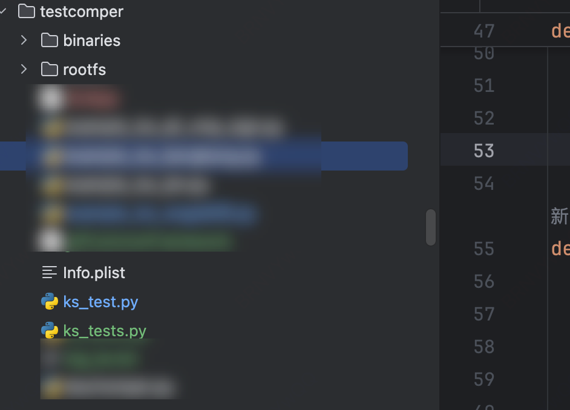
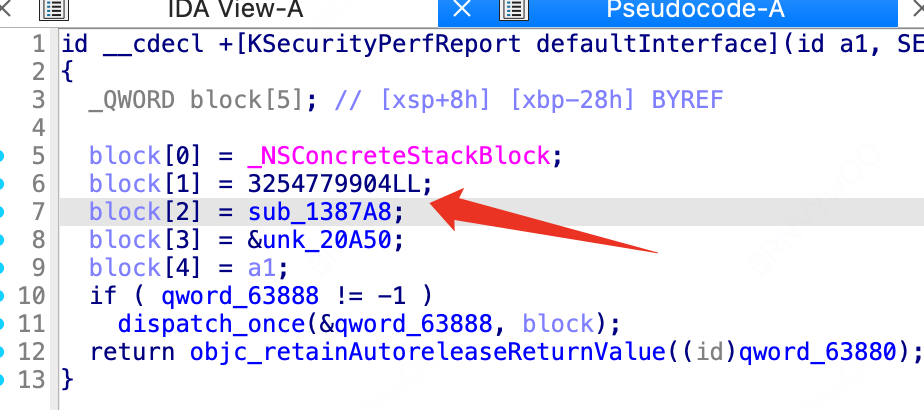
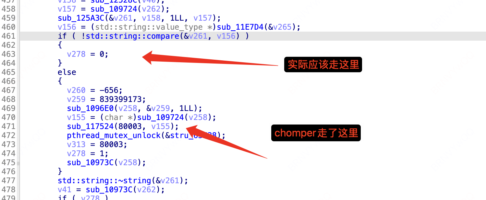

# 某手sig3-ios算法使用Chomper调用

Chomper-iOS界的Unidbg

最近在学习中发现一个Chomper框架，[Chomper](https://github.com/sledgeh4w/chomper) 是一个模拟执行iOS可执行文件的框架，类似于安卓端大名鼎鼎的Unidbg。

这篇文章使用Chomper模拟执行某手的sig3算法，初步熟悉该框架。这里只熟悉模拟执行步骤以及一些常见的hook操作、读取操作等。

#### 框架搭建

chomper 使用python开发，这里直接使用pip安装 pip install chomper (mac的m系列芯片，可能需要再自己电脑编译unicorn并安装)

下载chomper中`rootfs`​ 放在项目录下  如下：​

基础代码如下：

```objectivec
import os

from chomper import Chomper
from chomper.const import ARCH_ARM64, OS_IOS
from chomper.objc import ObjC
from chomper.utils import pyobj2nsobj
from chomper.os.ios.hooks import register_hook
from unicorn import arm64_const

base_path = os.path.abspath(os.path.dirname(__file__))


def trace_inst_callback(self, uc, address, size, user_data):
    for inst in self.cs.disasm_lite(uc.mem_read(address, size), 0):
        self.logger.info(
            f"Trace at {self.debug_symbol(address)}: {inst[-2]} {inst[-1]}"
        )

        message = ""
        for i in range(31):
            if message:
                message += ", "
            message += f"x{i}={hex(self.uc.reg_read(getattr(arm64_const, f'UC_ARM64_REG_X{i}')))}"
        self.logger.info(message)


Chomper.trace_inst_callback = trace_inst_callback #这里是用来trace代码
#加载ios基础库支持。
emu = Chomper(
    arch=ARCH_ARM64,
    os_type=OS_IOS,
    rootfs_path=os.path.join(base_path, "rootfs/ios"),
    enable_ui_kit=True, #开启ui_kit库支持，
)

objc = ObjC(emu)

```

### 某手核心算法调用

这里不再分析sig3怎么来的，以及如何构造的，如果需要请看兔哥公众号文章。https://mp.weixin.qq.com/s/JG56KxPC7s3oSvoGkQVBRQ

算法加载流程如下：根据frida-trace得

```objectivec
+[KWSecurity defaultInterface]
 22578 ms  -[KWSecurity atlasSign:/rest/app/square/home/mall/tab/dynamic/feed87fa757cb702565b6afa61de4f5f9617]
 22582 ms     | +[KWSecuritySignature atlasSignPlus:0x2852e18c0 isInner:0x0 sdkid:0x10eb67638 sdkName:0x10eb67638 ztconfigFilePath:0x10eb67638]
 22582 ms     |    | +[KWOpenSecurityGuardManager getInstance]
 22582 ms     |    | -[KWOpenSecurityGuardManager getSecureSignatureComp]
 22582 ms     |    |    | -[KWOpenSecurityGuardManager getComponent:0x0]
 22582 ms     |    |    |    | +[KWOpenComponentLibrary getInstance]
 22582 ms     |    |    |    | -[KWOpenComponentLibrary getComponent:0x0]
 22582 ms     |    |    |    |    | -[KWOpenComponentLibrary sdkDict]
 22582 ms     |    | +[KWOpenSecurityGuardParamContext createParamContextWithAppKey:d7b7d042-d4f2-4012-be60-d97ff2429c17 paramDict:nil requestType:0x1 input:{length = 75, bytes = 0x2f726573 742f6170 702f7371 75617265 ... 34663566 39363137 } wbindexKey:lD6We1E8i bInnerInvoke:0x0 sdkid: sdkName: ztconfigFilePath:]
 22589 ms     |    |    | -[KWOpenSecurityGuardParamContext setAppKey:0x100932dd8]
 22589 ms     |    |    | -[KWOpenSecurityGuardParamContext setWbindexKey:0x100932df8]
 22589 ms     |    |    | -[KWOpenSecurityGuardParamContext setParamDict:0x0]
 22590 ms     |    |    | -[KWOpenSecurityGuardParamContext setRequestType:0x1]
 22590 ms     |    |    | -[KWOpenSecurityGuardParamContext setInput:0x2876d4e70]
 22590 ms     |    |    | -[KWOpenSecurityGuardParamContext setOutput:nil]
 22590 ms     |    |    | -[KWOpenSecurityGuardParamContext setErrorCode:0x0]
 22590 ms     |    |    | -[KWOpenSecurityGuardParamContext setBInnerInvoke:0x0]
 22590 ms     |    |    | -[KWOpenSecurityGuardParamContext setSdkid:0x10eb67638]
 22590 ms     |    |    | -[KWOpenSecurityGuardParamContext setSdkname:0x10eb67638]
 22590 ms     |    |    | -[KWOpenSecurityGuardParamContext setZtconfigFilePath:0x10eb67638]
 22590 ms     |    | +[KWOpenSecurityGuardParamContext createParamContextWithAppKey ret:<KWOpenSecurityGuardParamContext: 0x285c9ba80>
 22591 ms     |    | -[KWOpenSecureSignatureComponent atlasSignPlus:0x285c9ba80]
 22591 ms     |    |    | +[KWOpenSecurityGuardManager getInstance]
 22591 ms     |    |    | -[KWOpenSecurityGuardManager isInitialize] 0x1
 22591 ms     |    |    | -[KWOpenSecurityGuardParamContext appKey]
 22591 ms     |    |    | -[KWOpenSecurityGuardParamContext bInnerInvoke]
 22591 ms     |    |    | -[KWOpenSecurityGuardParamContext input]
 22591 ms     |    |    | -[KWOpenSecurityGuardParamContext sdkid]
 22591 ms     |    |    | -[KWOpenSecurityGuardParamContext sdkname]
 22591 ms     |    |    | -[KWOpenSecurityGuardParamContext ztconfigFilePath]
 22591 ms     |    |    | -[KWOpenSecurityGuardManager callCoreCommand:0x28b2 appkey:0x100932dd8 type:0x0 payload:0x0 context:0x0 isInputDataWithHeader:0x0 isOutputDataShuffleHeader:0x0 bInnerInvoke:0x2876d4e70 inputData:0x10eb67638 cdid:0x0 privatekeyData:0x10eb67638 sdkid:0x10eb67638 sdkName:0x10eb67638 ztconfigFilePath:0x17171f0d0 completion:0x20414ec30]
 22592 ms     |    |    | -[KWOpenSecurityGuardManager callCoreCommand:ret d7b7d042-d4f2-4012-be60-d97ff2429c17
 22592 ms     |    |    | -[KWOpenSecurityGuardParamContext setOutput:{length = 48, bytes = 0x36373736 30393335 32666262 66313665 ... 32323365 33303236 }]
 22593 ms     |    |    | -[KWOpenSecurityGuardParamContext setErrorCode:0x1]
 22593 ms     |    | -[KWOpenSecurityGuardParamContext errorCode]
 22593 ms     |    | -[KWOpenSecurityGuardParamContext output] {length = 48, bytes = 0x36373736 30393335 32666262 66313665 ... 32323365 33303236 }
 22594 ms     |    | -[KWOpenSecurityGuardParamContext output] {length = 48, bytes = 0x36373736 30393335 32666262 66313665 ... 32323365 33303236 }
 22595 ms  WSecurity atlasSign ret 677609352fbbf16ef42f2c2d57deecf00fdd8252223e3026
```

#### 加载某手安全算法Framework

某手的算法核心是在gifCommonFramework库中。砸壳拿到ipa，从framework中拿到该dylib，开始加载，如下代码就加载完了，是不是感觉很简单。

```objectivec
binary_path = "gifCommonFramework"
ks = emu.load_module(
    module_file=os.path.join(base_path, binary_path),
    exec_init_array=True,
    #trace_symbol_calls=True,#trace symbol符号
    #trace_inst=True,#trace code 
)
```

#### 初始化安全SDK

如下代码，模拟调用oc的方法调用。

1. oc中的+的符号可直接调用，类似安卓中的public static方法；-符号需要进行初始化动作之后才可以调用，类似安卓中的需要new才可以调用的方法。

安全SDK进行初始化，通过getInstance之后获取该地址，并使用该地址进行调用initSDK。这块还有一个hook操作。

​​

```objectivec
def hook_retval(retval): #hook 修改返回值
    def decorator(uc, address, size, user_data):
        return retval

    return decorator

emu.add_interceptor(ks.base + 0x1387A8, hook_retval(0)) 

KWOpenSecurityGuardManager_addr = objc.msg_send("KWOpenSecurityGuardManager", "getInstance")
print(KWOpenSecurityGuardManager_addr)
objc.msg_send(KWOpenSecurityGuardManager_addr, "initSDK")
objc.msg_send(KWOpenSecurityGuardManager_addr, "setIsInitialize:", 1)

```

#### 算法调用

根据frida-trace代码可得。atlasSignPlus传递的是`KWOpenSecurityGuardParamContext createParamContextWithAppKey `​ 之后的地址。

```objectivec
 encrypt_str="加密信息"
 encrypt_addr = objc.msg_send("KWOpenSecurityGuardParamContext",
                                 "createParamContextWithAppKey:paramDict:requestType:input:wbindexKey:bInnerInvoke:sdkid:sdkName:ztconfigFilePath:",
                                 pyobj2nsobj(emu, "d7b7d042-d4f2-4012-be60-d97ff2429c17"),
                                 0,
                                 1,
                                 pyobj2nsobj(emu, encrypt_str.encode()),
                                 pyobj2nsobj(emu, "lD6We1E8i"), 0, pyobj2nsobj(emu, ""), pyobj2nsobj(emu, ""),
                                 pyobj2nsobj(emu, ""))
#这里原本不是这样调用的，我为了方便不再引入其他东西，使用了类似java的new 然后直接调用atlasSignPlus，
KWOpenSecureSignatureComponent = objc.msg_send("KWOpenSecureSignatureComponent", "alloc")
KWOpenSecureSignatureComponent_init = objc.msg_send(KWOpenSecureSignatureComponent, 'init')
result = objc.msg_send(KWOpenSecureSignatureComponent_init, "atlasSignPlus:", encrypt_addr) #这里传递的就是地址，直接传。
print(result)
```

这里`KWOpenSecurityGuardParamContext createParamContextWithApp`​的方法是+，那便可以直接调用。这里也仅仅是设置好需要加密的一些参数。

这里最后其实是出不了具体的结果的，这里还要感谢兔哥的trace代码，从trace代码中发现了如下图。

​​

1. pyobj2nsobj 用来将python类型转为oc类型，int 类型默认即可。
2. pyobj2cfobj python类型转为oc的cf类型。

#### 加入hook校验

hook 之后直接返回0 使对比结果正确。

```objectivec

emu.add_interceptor(ks.base + 0x18F8C8, hook_retval(0)) #这里对比d7b7d042-d4f2-4012-be60-d97ff2429c17
```

#### 输出结果

output其实返回的是一个nsdata类型。根据frida-trace的代码。这里就是bytes为最后需要的

```objectivec
    error_code = objc.msg_send(result, "errorCode")
    print(error_code)
    output = objc.msg_send(result, "output")#这里是nsdata
    data_bytes = objc.msg_send(output, "bytes") #这里就是获取bytes
    # 4b5a08193cf6b70803030001a41524cc1f87ae7e1e121c0a
    print(emu.read_string(data_bytes)) #这里直接读取bytes为string
```

#### 固定随机因子

这里主要是说 随机数 时间戳等

 chomper/os/ios/syscall.py

​`handle_sys_gettimeofday`​

chomper/os/ios/hooks.py

​`hook_srandom`​、`hook_time`​、`hook_random`​

#### 补环境

如下即可。其他复杂的操作，可以看下作者的仓库。

```objectivec
@register_hook("-[NSUserDefaults(NSUserDefaults) registerDefaults:]")
def hook_ns_user_defaults_register_defaults(uc, address, size, user_data):
    print("hook_ns_user_defaults_register_defaults")
    return 0
```

#### 其他hook操作

```objectivec
#直接hook oc方法 并修改返回值为oc obj类型
emu.add_interceptor("-[NSBundle bundleIdentifier]", hook_retval(pyobj2nsobj(emu, "com.ceair.b2m")))
#hook 一个地址并修改返回值
emu.add_interceptor(byd.base + 0x103C984A4, hook_retval(1))
#跳过一个函数不执行
def hook_skip(uc, address, size, user_data):
    pass
emu.add_interceptor("-[NSBundle initWithPath:]", hook_skip)

#这也是hook 一个地址。
def hook_call_compare(uc, address, size, user_data):
    emu = user_data["emu"]
	return 0
emu.add_hook(ks.base + 0x121724, hook_call_compare)
```

#### 主动调用操作

除了文章主动调用sig3的案例外，还有如下：

```objectivec
#主动调用symbol获取uuid
CFUUIDCreateString = emu.find_symbol("_CFUUIDCreateString").address 
cfu = emu.call_symbol("_CFUUIDCreate", 0, )
uuids = emu.call_symbol("_CFUUIDCreateString", 0, cfu)

#主动调用地址
a1 = emu.create_string("1")
a2 = emu.create_string(s)
a3 = len(s)
a4 = emu.create_string(str('1'))
a5 = emu.create_buffer(8)
a6 = emu.create_buffer(8)
a7 = emu.create_string("1123123123")
emu.call_address(dddd.base + 0x109322118, a1, a2, a3, a4, a5, a6, a7)
```

#### TraceCode

目前作者官方还没支持上，不过作者也给了一份代码。后续应该有，也有下断点debug，

trace开启代码如下： 

```objectivec

from unicorn import arm64_const


def trace_inst_callback(self, uc, address, size, user_data):
    for inst in self.cs.disasm_lite(uc.mem_read(address, size), 0):
        self.logger.info(
            f"Trace at {self.debug_symbol(address)}: {inst[-2]} {inst[-1]}"
        )
        message = ""
        for i in range(31):
            if message:
                message += ", "
            message += f"x{i}={hex(self.uc.reg_read(getattr(arm64_const, f'UC_ARM64_REG_X{i}')))}"
        self.logger.info(message)


Chomper.trace_inst_callback = trace_inst_callback


```

效果如下：

​​

‍

#### ipa本身相关的信息读取

将ipa中的info.plist放在和二进制文件一起的位置即可，chomper会自动加载处理。主要涉及如下两个。

```objectivec

bundle_identifier = info_data["CFBundleIdentifier"]
bundle_executable = info_data["CFBundleExecutable"]
```

### 总结

本文主要是介绍Chomper的算法模拟执行，Chomper目前已经已经是能比较完整的模拟ios可执行文件执行的模拟器，在这块有非常大的优势。

以前安卓端有强势的unidbg，现在iOS也有Chomper了，后续等待作者持续更新，完善Chomper。强势推荐一波-> Chomper地址: https://github.com/sledgeh4w/chomper。

我这块也已经使用Chomper完成雅迪系列、某手的算法调用。后续也会有更多扩展。

#### 算法代码：

```objectivec
import logging
import os

from chomper import Chomper
from chomper.const import ARCH_ARM64, OS_IOS
from chomper.objc import ObjC
from chomper.utils import pyobj2nsobj
from chomper.os.ios.hooks import register_hook

base_path = os.path.abspath(os.path.dirname(__file__))

log_format = "%(asctime)s - %(name)s - %(levelname)s: %(message)s"
logging.basicConfig(
    format=log_format,
    level=logging.INFO,
)

logger = logging.getLogger()

handler = logging.FileHandler('log_ks.txt', mode='w', encoding='utf-8')
handler.setLevel(logging.INFO)
handler.setFormatter(logging.Formatter(log_format))

console = logging.StreamHandler()
console.setLevel(logging.INFO)

logger.addHandler(handler)


def hook_retval(retval):
    def decorator(uc, address, size, user_data):
        return retval

    return decorator


@register_hook("-[NSUserDefaults(NSUserDefaults) registerDefaults:]")
def hook_ns_user_defaults_register_defaults(uc, address, size, user_data):
    print("hook_ns_user_defaults_register_defaults")
    return 0


def hook_call_compare(uc, address, size, user_data):
    emu = user_data["emu"]
    return 0


from unicorn import arm64_const


def trace_inst_callback(self, uc, address, size, user_data):
    for inst in self.cs.disasm_lite(uc.mem_read(address, size), 0):
        self.logger.info(
            f"Trace at {self.debug_symbol(address)}: {inst[-2]} {inst[-1]}"
        )
        message = ""
        for i in range(31):
            if message:
                message += ", "
            message += f"x{i}={hex(self.uc.reg_read(getattr(arm64_const, f'UC_ARM64_REG_X{i}')))}"
        self.logger.info(message)


Chomper.trace_inst_callback = trace_inst_callback

binary_path = "gifCommonFramework"
emu = Chomper(
    arch=ARCH_ARM64,
    os_type=OS_IOS,
    rootfs_path=os.path.join(base_path, "rootfs/ios"),
    # trace_symbol_calls=True,
)

ks = emu.load_module(
    module_file=os.path.join(base_path, binary_path),
    exec_init_array=True,
    trace_symbol_calls=True,
    trace_inst=True,
    # trace_symbol_calls=True
)
objc = ObjC(emu)

emu.add_interceptor(ks.base + 0x1387A8, hook_retval(0))
emu.add_interceptor(ks.base + 0x18F8C8, hook_retval(0))

KWOpenSecurityGuardManager_addr = objc.msg_send("KWOpenSecurityGuardManager", "getInstance")
print(KWOpenSecurityGuardManager_addr)
objc.msg_send(KWOpenSecurityGuardManager_addr, "initSDK")

objc.msg_send(KWOpenSecurityGuardManager_addr, "setIsInitialize:", 1)
# 这里根据frida-trace代码实际执行的构造
encrypt_str = input("enc:")
encrypt_addr = objc.msg_send("KWOpenSecurityGuardParamContext",
                             "createParamContextWithAppKey:paramDict:requestType:input:wbindexKey:bInnerInvoke:sdkid:sdkName:ztconfigFilePath:",
                             pyobj2nsobj(emu, "d7b7d042-d4f2-4012-be60-d97ff2429c17"),
                             0,
                             1,
                             pyobj2nsobj(emu, encrypt_str.encode()),
                             pyobj2nsobj(emu, "lD6We1E8i"), 0, pyobj2nsobj(emu, ""), pyobj2nsobj(emu, ""),
                             pyobj2nsobj(emu, ""))
KWOpenSecureSignatureComponent = objc.msg_send("KWOpenSecureSignatureComponent", "alloc")
KWOpenSecureSignatureComponent_init = objc.msg_send(KWOpenSecureSignatureComponent, 'init')
result = objc.msg_send(KWOpenSecureSignatureComponent_init, "atlasSignPlus:", encrypt_addr)
print(result)

error_code = objc.msg_send(result, "errorCode")
print(error_code)

output = objc.msg_send(result, "output")
data_bytes = objc.msg_send(output, "bytes")
print(emu.read_string(data_bytes))
```

‍

‍
